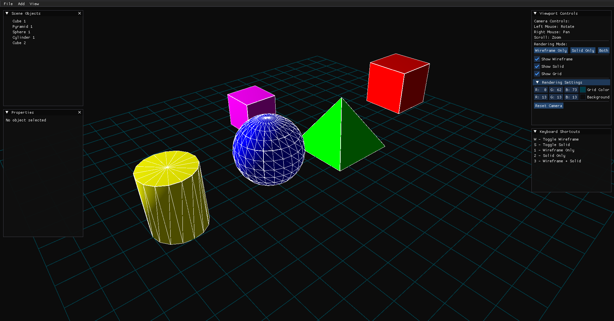

## Simple Parametric 3D Modeller


### Install dependencies for Ubuntu 22.04:
```sh
sudo apt update
sudo apt install libglfw3-dev libglew-dev libglm-dev cmake build-essential
```
For other distros, check their package managers.

## For Build and Run
```sh
# clone this repository
make build
make run
```